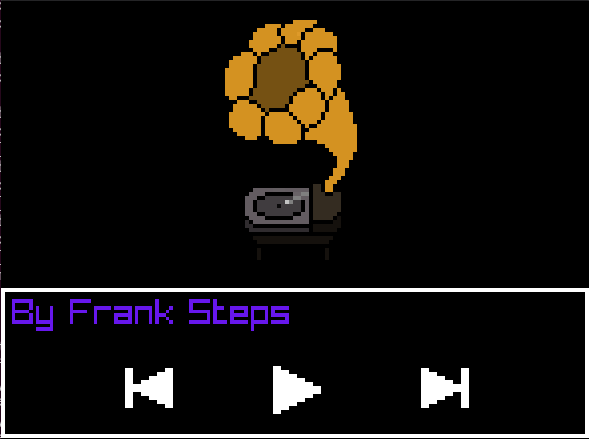
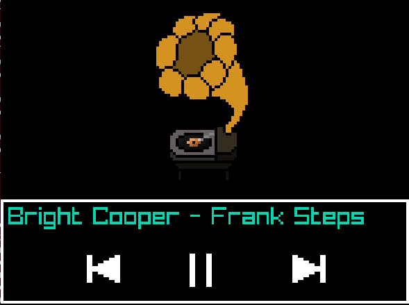

# Tocador de Músicas — Frank Steps

## Informações do Projeto
- **Compositor:** Francisco Passos / *Frank Steps*  
- **Desenvolvedor:** Francisco Passos / *Frank Steps*  
- **Data de criação:** 02/08/2025  
- **Última modificação:** 22/09/2025  

---

## Descrição
Este projeto é um **tocador de músicas** desenvolvido em **C++** utilizando a biblioteca [raylib](https://www.raylib.com/).  
O objetivo principal é explorar funcionalidades de **áudio**, **imagem** e **interação com teclado** de forma simples e didática.  

## Músicas
As músicas usadas neste projeto são composições originais de **Frank Steps**.  

- EP **“Cyan Chemistry”** (4 faixas)  
- Single **“Sweet Childhood”**  

### Licença de uso das músicas
As faixas estão sob **Creative Commons (CC)** e podem ser acessadas nas seguintes plataformas:  

- [YouTube](https://www.youtube.com/@Frank_Steps) — todas as músicas  
- [Bandcamp](https://franksteps.bandcamp.com/) — todas as músicas  
- [Spotify](https://open.spotify.com/intl-pt/artist/6Ow1TOWQonC9AVL3WxHy3d) — exceto *Sweet Childhood* e *Bright Cooper*  
- [Amazon Music](https://music.amazon.com.au/artists/B0D2Z8C41S/frank-steps) — exceto *Sweet Childhood* e *Bright Cooper*  
- [Indiefy](https://music.indiefy.net/artist/frank-steps) — exceto *Sweet Childhood* e *Bright Cooper*  

---
## 📜 Licença

- **Código do projeto:** Licenciado sob a [MIT License](LICENSE).  
- **Músicas (EP *Cyan Chemistry* e single *Sweet Childhood*):** Licenciadas sob [Creative Commons BY-NC-SA 4.0](https://creativecommons.org/licenses/by-nc-sa/4.0/).  

